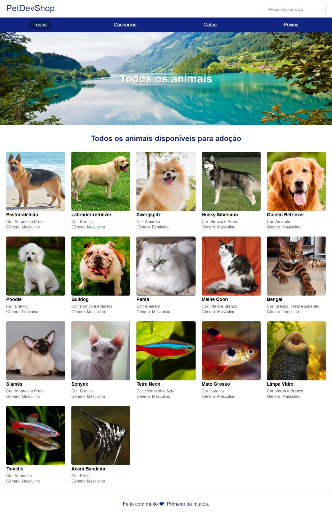

<h1 align=" center"> 
    PetDevShop 😽
</h1>

<h1>
    
</h1>

<h2 align="center">
    <a href="https://agile-refuge-33537.herokuapp.com/">Ver projeto</a>
</h2>

<h2>🚨 Sobre </h2>

Projeto PetDevShop. Feito com typescript e nodets.

<h2>🔨 Ferramentas </h2>

- HTML
- CSS
- TYPESCRIPT
- NODETS

### Pré-requisitos globais:
`npm i -g nodemon typescript ts-node`

### Instalação
`npm install`

### Para rodar o projeto
`npm run start-dev`
